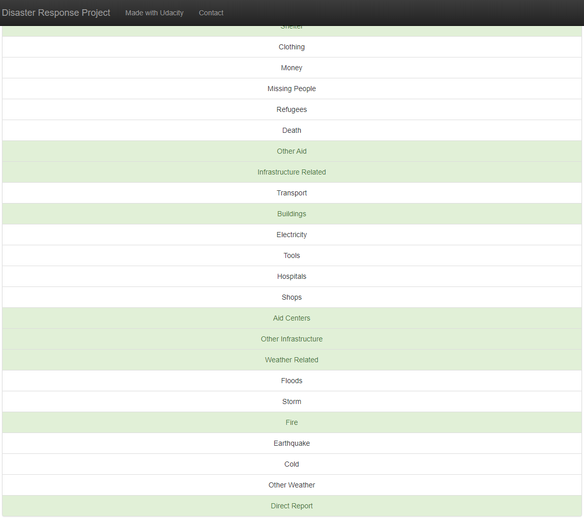

# Disaster Response Pipeline Project

### Table of Contents

1. [Installation and Instructions](#installation)
2. [Project Motivation](#motivation)
3. [File Descriptions](#files)
4. [Results](#results)
5. [Licensing, Authors, and Acknowledgements](#licensing)

## Installation and Instructions 

All aditional python libraries to run this project are in *requirements.txt*. The code should run in Python versions 3.*.

1. To install all dependences, run in comand line: 
          `pip install -r requirements.txt`

2. Run the following commands in the project's root directory to set up database and model.

    - To run ETL pipeline that cleans data and stores in database:
        `python src/process_data.py data/raw/disaster_messages.csv data/raw/disaster_categories.csv data/processed/DisasterResponse.db`
    - To run ML pipeline that trains classifier, saves it and stores results in database:
        `python src/train_classifier.py data/processed/DisasterResponse.db models/model.pkl`

3. Run the following command in the project's root directory to run web app:
    `python wsgi.py`

4. Go to http://0.0.0.0:3001//

## Project Motivation

For this project, I was interestested in creating a machine learning model to predict if a natural disaster happens based in text messages. 
The solution is a pipeline end-to-end to deploy a web app with model embedded in a cloud service.

All raw data sets were organized and labeled by [Figure Eight](https://appen.com/). 

## File Descriptions 

1. File structure of the project:

<pre>
<code>
.
|-- app
|   |-- template
|   |   |-- master.html  # main page of web app
|   |   |-- go.html  # classification result page of web app
|   |-- __init__.py # app module init
|   |-- run.py  # Flask file that runs app
|-- data
|   |-- processed
|   |   |-- DisasterResponse.db # sqlite database to store processed data.
|   |-- raw
|   |   |-- disaster_categories.csv  # data to process 
|   |   |-- disaster_messages.csv  # data to process
|-- docs
|   |-- imgs
|   |   |-- home_app.PNG # picture of home app
|   |   |-- plots.PNG # picture of plots
|   |   |-- model_result_1.PNG # picture 1 of model prediction
|   |   |-- model_result_2.PNG # picture 2 of model prediction
|-- models
|   |-- model.pkl  # saved model 
|-- src
|   |-- process_data.py # script to process raw data
|   |-- train_classifier.py # script to train a new model
|-- utils_pkg
|   |-- utils_pkg # 
|   |   |-- __init__.py # package init
|   |   |-- transformers.py # module containing custom sklearn transformers
|   |   |-- utils.py # module containing auxilar functions
|   |-- setup.py # package setup
|-- LICENSE 
|-- Procfile # config file to deploy in Heroku plataform
|-- README.md
|-- requirements.txt # dependencies
|-- wsgi.py # entry point to run the app

</code>
</pre>

2. In `data/processed/DisasterResponse.db` there are 2 tables:
- *messages* - process data
- *results* - model score metrics for test data

## Results 

1. Home app and plots:

2. Example of model's predict:

3. Deploy:

The application can be accessed [here](https://dis-resp-app.herokuapp.com/).

4. Features used to train the model:
- TF-IDF extractions of message after text processing
- Number of tokens in the message
- Message genre

5. Modeling challeges:

This problem has a lot of imbalanced labels. As example, *child_alone* was dropped because there is not positive samples for
it. 
The impact of imbalanced data is the possibility of trainned model to be biased for the majority class. Therefore, during model training, class_weight was set up
to 'balanced' as a possible treatment. However, it is observed in graph *F1-score x Percentage of positive class* that in labels too imbalanced, the performance
decreases a lot.

## Licensing, Authors, Acknowledgements 

All raw data credit is from Figure Eight. Otherwise, use the code as you wish. 
